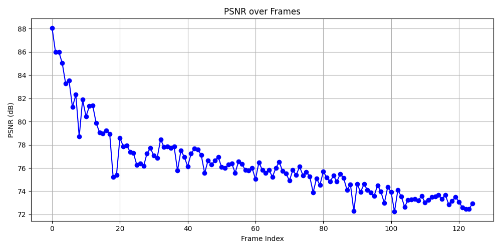

[](https://classroom.github.com/a/SdXSjEmH)

# EV-HW3: PhysGaussian

This homework is based on the recent CVPR 2024 paper [PhysGaussian](https://github.com/XPandora/PhysGaussian/tree/main), which introduces a novel framework that integrates physical constraints into 3D Gaussian representations for modeling generative dynamics.

# Code Execution

## Setup

```bash
cd PhysGaussian
conda env create -f environment.yml
conda activate PhysGaussian

pip install -r requirements.txt
pip install -e gaussian-splatting/submodules/diff-gaussian-rasterization/
pip install -e gaussian-splatting/submodules/simple-knn/

# Install ffmpeg
sudo apt-get update
sudo apt-get install ffmpeg
```

## Data Preparation

```bash
pip install gdown
bash download_sample_model.sh
```

## Generate Simulation

```bash
python gs_simulation.py --model_path <path to gs model> --output_path <path to output folder> --config <path to json config file> --render_img --compile_video
```

For example:

```bash
python gs_simulation.py --model_path ./model/ficus_whitebg-trained/ --output_path output_jelly_ngrid50 --config ./config/ficus_config.json --render_img --compile_video --white_bg
```

## Calculate PSNR

```bash
cd ../
python calculate_psnr.py --target_path <target simulation> --gt_path <ground truth (default settings) simulation>
```

For example:

```bash
python calculate_psnr.py --target_path ./PhysGaussian/output_jelly_ngrid10 --gt_path ./PhysGaussian/output_jelly_ngrid50
```

# Part 1: Baseline Simulation

## Jelly

https://www.youtube.com/shorts/5GNTh0lBeeU

## Plasticine

https://www.youtube.com/shorts/iLd7ug_VbH4

# Part 2: Adjust MPM Parameters

## n_grid

Add and adjust the `n_grid` parameter in `config/ficus_config.json` (default is 50)


## Jelly

### 1. `n_grid = 30`

https://www.youtube.com/shorts/D0kW8d4Tikg


### 2. `n_grid = 10`

https://www.youtube.com/shorts/BLnc6jvB53k


## Plasticine

### 1. `n_grid = 30`

https://www.youtube.com/shorts/K7HVXt4mNFo


### 2. `n_grid = 10`

https://www.youtube.com/shorts/xFlCy4W4KgE


### Discussion

When decreasing `n_grid`, the deformation becomes smaller. Also, decreasing `n_grid` causes lower resolution, which makes the simulation less realistic and has lower average PSNR.

## substep_dt

Adjust the `substep_dt` parameter in `config/ficus_config.json` (default is 1e-4)


## Jelly

### 1. `substep_dt = 8e-5`

https://www.youtube.com/shorts/N4htPQcErrA


### 2. `substep_dt = 5e-5`

https://www.youtube.com/shorts/5MJdbJBBygM


## Plasticine

### 1. `substep_dt = 8e-5`

https://www.youtube.com/shorts/w0sirUD99o8


### 2. `substep_dt = 5e-5`

https://www.youtube.com/shorts/CWTG25FwAQM


### Discussion

When increasing `substep_dt`, the simulation bounces and oscillates more dynamically. Also, the inference time becomes longer when decreasing `substep_dt`.

## grid_v_damping_scale

Adjust the `grid_v_damping_scale` parameter in `config/ficus_config.json` (default is 0.9999)


## Jelly

### 1. `grid_v_damping_scale = 0.9995`

https://www.youtube.com/shorts/lUXSxH0Gieo


### 2. `grid_v_damping_scale = 1.0005`

https://www.youtube.com/shorts/h1w8rzZhdJA


## Plasticine

### 1. `grid_v_damping_scale = 0.9995`

https://www.youtube.com/shorts/eGPtzsgI-Jc


### 2. `grid_v_damping_scale = 1.0005`

https://www.youtube.com/shorts/9IkyPJS1fcQ


### Discussion

When decreasing `grid_v_damping_scale`, the energy loss becomes larger and the simulation comes to rest quickly. In contrast, setting `grid_v_damping_scale > 1` injects energy into the system, causing the simulation becomes more unstable.

## softening

Add and adjust the `softening` parameter in `config/ficus_config.json` (default is 0.1)


## Jelly

### 1. `softening = 1`

https://www.youtube.com/shorts/5TvY7QjCx20


### 2. `softening = 10`

https://www.youtube.com/shorts/WNxolxP-1bY



## Plasticine

### 1. `softening = 1`

https://www.youtube.com/shorts/BE4gyx4Ihyg


### 2. `softening = 10`

https://www.youtube.com/shorts/014bv8QRMzU


### Discussion

Increasing `softening` makes the object slightly less rigid but the effect is not obvious. The PSNR gradually decreases over frames.

# Bonus

I would design a neural network to infer physical parameters from observed motion (e.g. video). The network can be trained with supervision from a differentiable physics simulation loop that compares the predicted dynamics to ground-truth observations using perceptual and physical consistency losses.

# Reference

```bibtex
@inproceedings{xie2024physgaussian,
    title     = {Physgaussian: Physics-integrated 3d gaussians for generative dynamics},
    author    = {Xie, Tianyi and Zong, Zeshun and Qiu, Yuxing and Li, Xuan and Feng, Yutao and Yang, Yin and Jiang, Chenfanfu},
    booktitle = {Proceedings of the IEEE/CVF Conference on Computer Vision and Pattern Recognition},
    year      = {2024}
}
```
